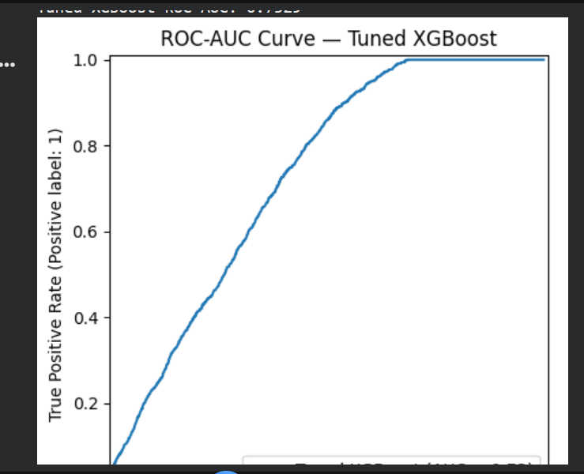
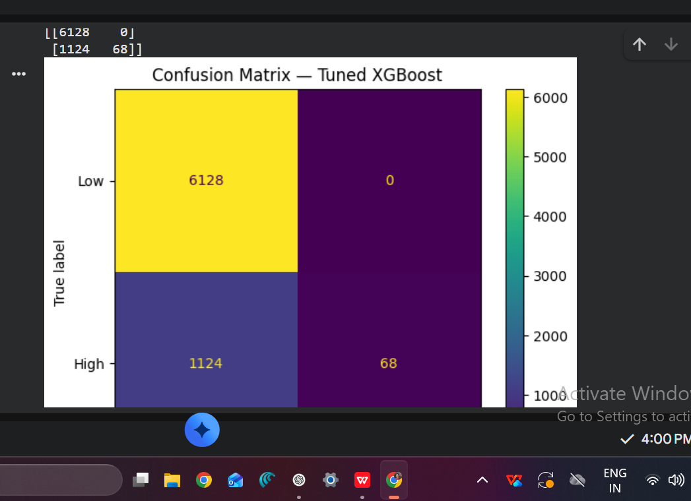

# 🎯 Monopoly Live Outcome Analysis & Machine Learning Prediction

## 📌 Project Overview

This project investigates whether historical **Monopoly Live** game
statistics can provide useful predictive information about future game
outcomes.

Approximately three months of historical game statistics were cleaned,
transformed, and evaluated using multiple machine-learning
classification models.

> **Important:** This is an educational machine-learning project. The
> results do not demonstrate a reliable method for predicting or gaining
> an advantage over future casino outcomes.

## 🎯 Objective

The problem was formulated as binary classification:

-   **Low:** `1x`, `2x`, `5x`
-   **High:** `10x`, `20x`, `40x`, `50x`
-   `0 = Low`
-   `1 = High`

## 📊 Dataset

The original dataset contained approximately **50,000 records** and 11
columns.

After removing exact duplicates and retaining completed rounds,
approximately **48,816 completed rounds** remained.

Important fields included:

-   `round_code`
-   `when`
-   `result`
-   `multiplier`
-   `rolls`
-   `chance_multiplier`
-   `total_winners`
-   `total_payout`
-   `when_datetime`
-   `when_datetime_ist`

## 🧹 Data Cleaning

1.  Removed exact duplicate rows.
2.  Sorted records chronologically.
3.  Identified completed rounds using `chance_multiplier == 0`.
4.  Verified unique completed `round_code` values.
5.  Created usable datetime features.
6.  Removed early rows without sufficient historical information.

## ⚙️ Feature Engineering

Historical features included:

-   Previous 1--5 results
-   Previous 1--5 multipliers
-   Rolling multiplier mean and standard deviation over 5, 10 and 20
    rounds
-   Historical result counts over 10 and 20 rounds
-   Hour, minute and day of week
-   Weekend indicator
-   Cyclical hour features
-   Previous-result streak

Rolling and lag features were shifted so that information from the
current outcome was not used to predict itself.

## 🚫 Leakage Prevention

Current-round outcome and post-outcome variables were excluded from the
predictors, including:

-   Current `result`
-   Current `multiplier`
-   `total_winners`
-   `total_payout`
-   `chance_multiplier`

This prevented future/current outcome information from artificially
inflating model performance.

## 🧪 Validation Strategy

Because the data is sequential, a random train/test split was avoided.

The data was split chronologically:

-   **70% Training**
-   **15% Validation**
-   **15% Testing**

Hyperparameter tuning used **TimeSeriesSplit**.

## 🤖 Models Evaluated

-   Logistic Regression
-   Random Forest
-   XGBoost

### Initial comparison

  -----------------------------------------------------------------------------
  Model            Accuracy     Balanced           F1      ROC-AUC       PR-AUC
                                Accuracy                           
  ------------ ------------ ------------ ------------ ------------ ------------
  Logistic           0.4231   **0.6308**   **0.3464**       0.6541       0.2314
  Regression                                                       

  Random             0.8324       0.5346       0.1532   **0.7188**       0.3243
  Forest                                                           

  XGBoost        **0.8418**       0.5312       0.1267       0.7164       0.3220
  -----------------------------------------------------------------------------

## 🔧 Hyperparameter Tuning

Random Forest and XGBoost were tuned using `RandomizedSearchCV` with
`TimeSeriesSplit`.

### Before vs. after tuning

  Model                              ROC-AUC       F1       PR-AUC     Accuracy
  ----------------------------- ------------ -------- ------------ ------------
  Random Forest --- Before            0.7188   0.1532       0.3243       0.8324
  **Random Forest --- Tuned**     **0.7310**   0.1079       0.3361       0.8464
  XGBoost --- Before                  0.7164   0.1267       0.3220       0.8418
  **XGBoost --- Tuned**           **0.7329**   0.1079   **0.3411**   **0.8464**

### 🏆 Selected Model

**Tuned XGBoost**

It achieved the highest ROC-AUC and PR-AUC among the evaluated models.

## 📈 Final Evaluation

### ROC-AUC

**ROC-AUC = 0.7329**

The model shows moderate ability to distinguish Low from High outcomes
in the historical test set.

### F1 Score

**F1 = 0.1079**

The low F1 indicates weak performance in identifying the High class at
the default classification threshold.

### Confusion Matrix

``` text
                 Predicted
                 Low    High
Actual Low      6128      0
Actual High     1124     68
```

-   True Negatives: **6128**
-   False Positives: **0**
-   False Negatives: **1124**
-   True Positives: **68**
-   High-class recall: approximately **5.7%**


## 📊 Model Evaluation Visuals

### ROC-AUC Curve — Tuned XGBoost



**ROC-AUC: 0.7329**

### Confusion Matrix — Tuned XGBoost



The confusion matrix highlights the class-imbalance issue: the model correctly identifies very few High outcomes despite its relatively high overall accuracy.

## 💡 Key Findings

1.  **Accuracy is misleading:** 84.64% accuracy looks strong, but the
    model strongly favors the majority Low class.
2.  **ROC-AUC is moderate:** 0.7329 indicates some statistical
    separation.
3.  **High-outcome detection is weak:** only about 5.7% of actual High
    outcomes were identified.
4.  **Tuning improved ranking metrics:** XGBoost ROC-AUC increased from
    0.7164 to 0.7329 and PR-AUC from 0.3220 to 0.3411.
5.  **The predictive signal is limited:** the results do not establish
    reliable prediction of future casino outcomes.

## 🧠 Final Conclusion

This project investigated whether historical Monopoly Live game data
could be used to distinguish Low and High outcomes.

The tuned XGBoost model achieved a **ROC-AUC of 0.7329** and **84.64%
accuracy**, but the confusion matrix showed that it correctly identified
only 68 of 1,192 High outcomes. The F1 score was also low at **0.1079**.

Therefore, the available historical features do **not provide sufficient
evidence of a reliable predictive signal for future Monopoly Live
outcomes**.

The main value of this project is methodological: it demonstrates data
cleaning, sequential feature engineering, leakage prevention, time-based
validation, model comparison, hyperparameter tuning, class-imbalance
analysis, and critical interpretation of machine-learning results.

> **Key takeaway:** A high accuracy score does not necessarily mean a
> model is useful, especially when the classes are imbalanced.

## 🛠️ Technologies Used

-   Python
-   Pandas
-   NumPy
-   Scikit-learn
-   XGBoost
-   Matplotlib
-   Jupyter Notebook

## 📁 Suggested Repository Structure

``` text
monopoly-live-ml-analysis/
│
├── data/
│   └── monopoly_data_full.csv
│
├── notebooks/
│   └── monopoly_live_analysis.ipynb
│
├── models/
│   └── tuned_xgboost.pkl
│
├── images/
│   ├── roc_auc_curve.png
│   └── confusion_matrix.png
│
├── requirements.txt
├── README.md
└── .gitignore
```

## 👨‍💻 Skills Demonstrated

**Machine Learning** - Binary classification - Logistic Regression -
Random Forest - XGBoost - Hyperparameter tuning

**Data Science** - Data cleaning - Feature engineering - Sequential data
analysis - Class imbalance - Model evaluation

**Validation** - Chronological splitting - TimeSeriesSplit - ROC-AUC -
PR-AUC - F1 - Confusion matrix

## ⭐ Portfolio Summary

Built an end-to-end machine-learning pipeline on 50K+ sequential
Monopoly Live records, engineering lag, rolling, frequency and temporal
features while preventing target leakage. Compared Logistic Regression,
Random Forest and XGBoost, then tuned tree-based models using
time-series cross-validation. The final XGBoost model achieved a test
ROC-AUC of **0.7329**, while analysis showed that high accuracy did not
translate into reliable detection of High outcomes.
